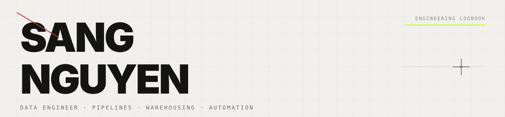
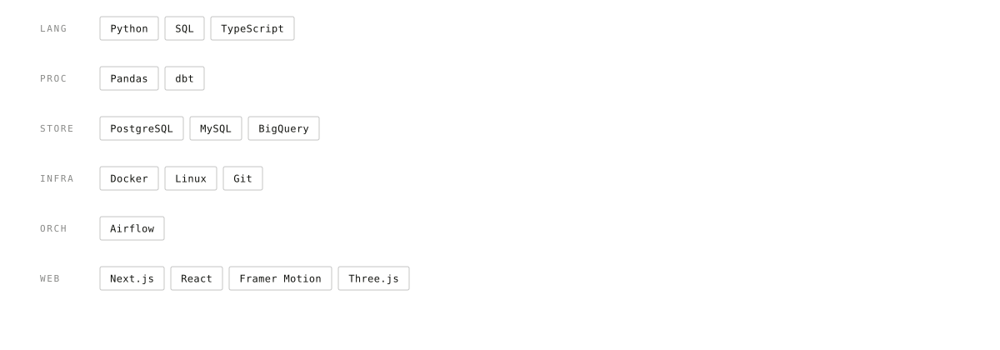
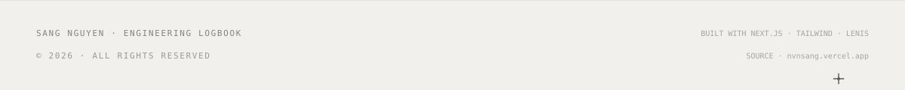

<picture>
  <source media="(prefers-color-scheme: dark)" srcset="assets/header-dark.svg">
  
</picture>

<code>STATUS  open to data engineering roles  &#183;  LOCATION  Ho Chi Minh City  &#183;  STACK  Python &#183; SQL &#183; dbt &#183; Airflow</code>

 

<picture>
  <source media="(prefers-color-scheme: dark)" srcset="assets/divider-dark.svg">
  
</picture>

### INDEX

| NODE | SECTION |
| :--- | :--- |
| NODE_01 | **[BIO](https://nvnsang.vercel.app/#bio)** &#8212; about the author |
| NODE_02 | **[PROJECTS](https://nvnsang.vercel.app/#projects)** &#8212; 4 build logs |
| NODE_03 | **[PIPELINE](https://nvnsang.vercel.app/#pipeline)** &#8212; pipeline runbook |
| NODE_04 | **[SKILLS](https://nvnsang.vercel.app/#skills)** &#8212; toolbox |

<picture>
  <source media="(prefers-color-scheme: dark)" srcset="assets/divider-dark.svg">
  
</picture>

### BIO

I build reliable data pipelines across the entire lifecycle &#8212; ingestion, data modeling, scheduled workflows, and observability. My software-engineering background means I treat data like production software: automated tests, schema versioning, idempotent reruns.

Currently shipping **warehouse tables** and **feature sets** that downstream models and operational dashboards can depend on without surprise failures.

&#8594; [Read the full logbook](https://nvnsang.vercel.app/#bio)

<picture>
  <source media="(prefers-color-scheme: dark)" srcset="assets/divider-dark.svg">
  
</picture>

### PROJECTS / BUILD LOG

| BUILD | STATUS | STACK | CASE STUDY |
| :--- | :--- | :--- | :--- |
| BUILD-01 Batch Ingestion & Feature Pipeline | SHIPPED | Python &#183; Pandas &#183; SQL &#183; LightGBM | [&#8594; read](https://nvnsang.vercel.app/#projects) |
| BUILD-02 Fraud-MLST Dimensionality Reduction | SHIPPED | Python &#183; UMAP &#183; scikit-learn &#183; Three.js | [&#8594; read](https://nvnsang.vercel.app/#projects) |
| BUILD-03 LOWOR &#8212; B2B Agricultural Export | SHIPPED | Next.js &#183; TypeScript &#183; Tailwind &#183; GSAP | [&#8594; read](https://nvnsang.vercel.app/#projects) |
| BUILD-04 MIORIN &#8212; Technology Corporate Website | SHIPPED | Next.js &#183; TypeScript &#183; Tailwind &#183; GSAP | [&#8594; read](https://nvnsang.vercel.app/#projects) |

<picture>
  <source media="(prefers-color-scheme: dark)" srcset="assets/divider-dark.svg">
  
</picture>

### SKILLS / TOOLBOX

<picture>
  <source media="(prefers-color-scheme: dark)" srcset="assets/skills-dark.svg">
  
</picture>

<picture>
  <source media="(prefers-color-scheme: dark)" srcset="assets/divider-dark.svg">
  
</picture>

<picture>
  <source media="(prefers-color-scheme: dark)" srcset="assets/footer-dark.svg">
  
</picture>

&#8594; [Email](mailto:your@email.com)  
&#8594; [GitHub](https://github.com/Sangbeo113)  
&#8594; [LinkedIn](https://linkedin.com/in/yourprofile)